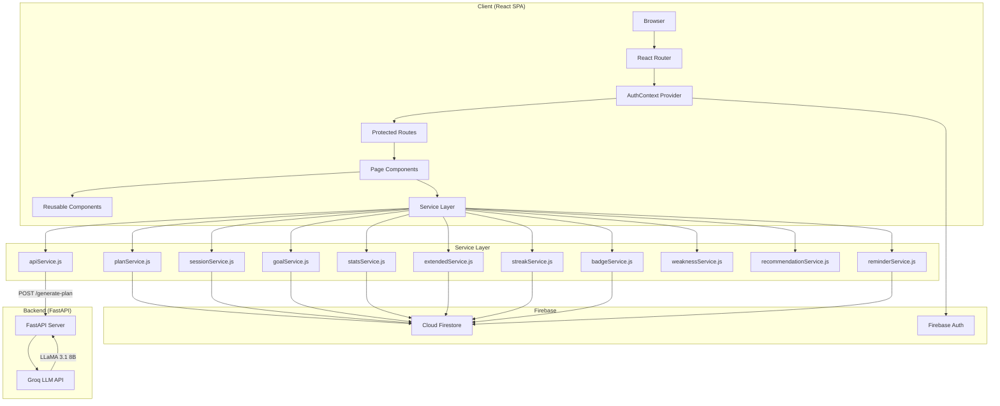
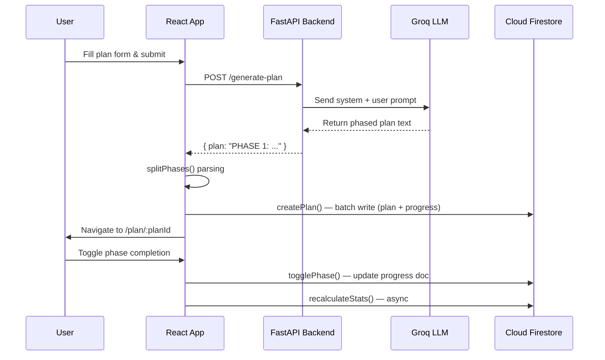
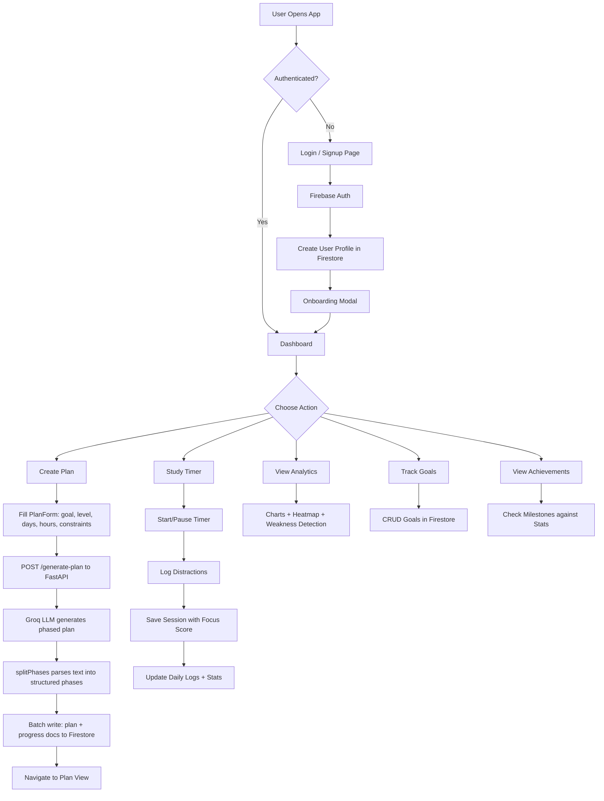

<


</div>

---

## 📑 Table of Contents

- [Project Overview](#project-overview)
- [Key Features](#key-features)
- [Screenshots](#screenshots)
- [Tech Stack](#tech-stack)
- [System Architecture](#system-architecture)
- [Folder Structure](#folder-structure)
- [Installation](#installation)
- [Environment Variables](#environment-variables)
- [Firebase Configuration](#firebase-configuration)
- [Running Locally](#running-locally)
- [Build](#build)
- [Deployment](#deployment)
- [Application Workflow](#application-workflow)
- [Routing](#routing)
- [Pages](#pages)
- [Components](#components)
- [State Management](#state-management)
- [Database Schema](#database-schema)
- [External APIs](#external-apis)
- [Dependencies](#dependencies)
- [Security](#security)
- [Performance](#performance)
- [Known Limitations](#known-limitations)
- [Future Enhancements](#future-enhancements)
- [Contributing](#contributing)
- [License](#license)
- [Acknowledgements](#acknowledgements)
- [Repository Statistics](#repository-statistics)

---

## Project Overview

**AcadPlan AI** is a full-stack academic planning platform that enables students to generate AI-powered, phased learning roadmaps, track daily study progress, and build productive study habits through gamification.

### Purpose

Provide students with a structured, data-driven approach to self-directed learning by combining AI plan generation with granular progress tracking, study analytics, and motivational features.

### Intended Users

- Students at any academic level (Beginner, Intermediate, Advanced)
- Self-learners building skill roadmaps
- Educators looking for structured planning tools

### Core Functionality

1. **AI Plan Generation** — Describe a learning goal, and the AI generates a phase-by-phase execution plan
2. **Progress Tracking** — Mark phases complete, log daily study hours, and track completion percentages
3. **Study Timer** — Built-in Pomodoro-style timer with focus mode, distraction tracking, and focus scoring
4. **Analytics Dashboard** — Visualize study patterns via charts, heatmaps, streak tracking, and weakness detection
5. **Achievements & Gamification** — Earn badges and milestones based on study activity and consistency

---

## Key Features

### 🤖 AI Planning

- AI-generated phased learning roadmaps via Groq LLM (LLaMA 3.1 8B)
- Customizable parameters: goal, level, duration, hours/day, constraints
- Categorization with tags (up to 5 per plan)
- Automatic plan parsing into structured phases with duration and risk extraction

### 📊 Dashboard & Analytics

- Aggregate stats: active plans, completed plans, time invested, sessions count
- Study streak tracking with daily login-based streak calculation
- Study weakness detection (stale plans, stuck phases, consistency gaps)
- Smart recommendations based on user stats and weaknesses
- Study heatmap (GitHub-style contribution grid)
- Line and bar charts for study hours over time (Chart.js)
- Per-plan progress breakdown

### ⏱️ Study Timer

- Start/pause/reset stopwatch with circular progress visualization
- Immersive fullscreen Focus Mode
- Distraction logging with descriptive notes
- Automatic focus score calculation (penalizes distractions)
- Ambient sound selector (Rain, White Noise, Lo-Fi — UI only)
- Session auto-save to Firestore with full metrics

### 📅 Calendar

- Monthly calendar view with heat-colored study activity
- Day-detail popover showing hours logged
- Month navigation with today highlighting

### 🎯 Goals

- Create, track, update, and delete personal learning goals
- Goal fields: title, description, target date, progress percentage
- Completion toggling with visual progress indicators

### 📋 Plan Management

- Plan history with search, filter, and grid/list view toggle
- Plan detail view with phase-by-phase content display
- Per-phase checkbox completion with timestamp recording
- Per-phase personal notes with 900ms debounced auto-save
- Plan-level global notes
- 5-star plan rating system
- Deadline countdown bar with color-coded urgency
- Plan deletion with confirmation modal

### 🏆 Achievements

- 8 badge types based on plans created, plans completed, streak length, and total study hours
- 6 milestone types covering sessions, hours, plans, and streaks
- Progress indicators showing advancement toward next milestone

### 🔔 Reminders & Notifications

- Configurable study reminder times (multiple time slots)
- Smart reminders based on study habit analysis
- 4-hour cooldown after dismissal
- Toast notification system (success, error, info)

### 📝 Study Sessions

- Linked study sessions tied to specific plans
- Session history with duration, focus score, and distraction data
- Session deletion with stats recalculation

### 👤 Profile & Settings

- User profile: name, email, academic level
- Settings: reminder times, smart suggestions toggle, email digest preference
- First-time user onboarding modal (5-step guided tour)

### 🔐 Authentication

- Firebase email/password authentication
- Protected routes with auth guard
- Auto-redirect to login for unauthenticated users

### 🎨 UI / UX

- Responsive design: desktop sidebar + mobile bottom navigation
- Framer Motion animations: page transitions, card animations, micro-interactions
- Google Fonts: Inter (body) + Poppins (display)
- CSS custom properties design system
- Lucide React icon library throughout

---

## Screenshots

> Screenshots can be placed in a `docs/images/` directory:

| Page | Path |
|------|------|
| Login | `docs/images/login.png` |
| Dashboard | `docs/images/dashboard.png` |
| Course Planner | `docs/images/planner.png` |
| Plan View | `docs/images/plan-view.png` |
| My Plans (History) | `docs/images/history.png` |
| Analytics | `docs/images/analytics.png` |
| Study Timer | `docs/images/timer.png` |
| Calendar | `docs/images/calendar.png` |
| Goals | `docs/images/goals.png` |
| Achievements | `docs/images/achievements.png` |
| Study Sessions | `docs/images/sessions.png` |
| Profile / Settings | `docs/images/profile.png` |

---

## Tech Stack

### Frontend

| Technology | Version | Purpose |
|---|---|---|
| React | 18.2 | UI component library |
| React Router DOM | 6.22 | Client-side routing |
| Framer Motion | 12.36 | Animations & page transitions |
| Chart.js | 4.5 | Analytics charts |
| react-chartjs-2 | 5.3 | React wrapper for Chart.js |
| Lucide React | 0.577 | Icon library |

### Backend

| Technology | Purpose |
|---|---|
| FastAPI | Python REST API framework |
| Groq SDK | LLM inference via LLaMA 3.1 8B |
| Pydantic | Request/response validation |
| Uvicorn | ASGI server |

### Database & Auth

| Service | Purpose |
|---|---|
| Firebase Authentication | Email/password sign-in |
| Cloud Firestore | NoSQL document database |

### Build Tools

| Tool | Purpose |
|---|---|
| Create React App (react-scripts 5.0.1) | Build toolchain, dev server, bundling |

### Styling

| Technology | Purpose |
|---|---|
| Vanilla CSS | Global styles & component styles |
| CSS Custom Properties | Design token system |
| Google Fonts (Inter, Poppins) | Typography |

### Testing

| Tool | Purpose |
|---|---|
| Jest | Test runner |
| @testing-library/react | Component testing utilities |
| @testing-library/jest-dom | DOM assertion matchers |
| @testing-library/user-event | User interaction simulation |

---

## System Architecture



### Application Layers

| Layer | Responsibility |
|---|---|
| **Pages** | Route-level components that compose UI and orchestrate data loading |
| **Components** | Reusable, presentation-focused UI components |
| **Services** | Firestore CRUD operations, API calls, business logic |
| **Context** | Global authentication state via React Context API |
| **Utils** | Pure utility functions (e.g., LLM output parsing) |

### Data Flow



---

## Folder Structure

```
academic-planner/
├── backend/
│   ├── main.py                    # FastAPI server + Groq LLM integration
│   ├── requirements.txt           # Python dependencies
│   └── render.yaml                # Render deployment config (empty)
├── public/
│   └── index.html                 # HTML template with Google Fonts
├── src/
│   ├── index.js                   # React DOM entry point
│   ├── App.js                     # Route definitions + layout + providers
│   ├── firebase.js                # Firebase init + auth/profile helpers
│   ├── context/
│   │   └── AuthContext.js         # Auth state, login/signup/logout, profile
│   ├── services/
│   │   ├── apiService.js          # POST /generate-plan (retry + timeout)
│   │   ├── planService.js         # Firestore CRUD for plans/progress/notes
│   │   ├── userService.js         # User profile read/write
│   │   ├── sessionService.js      # Study session CRUD
│   │   ├── goalService.js         # Goals CRUD
│   │   ├── statsService.js        # Aggregate stats recalculation
│   │   ├── streakService.js       # Milestones definition & checking
│   │   ├── badgeService.js        # Badge definitions & earned badges
│   │   ├── extendedService.js     # Streak, daily logs, settings, activity logs
│   │   ├── weaknessService.js     # Study weakness analysis (stale/stuck/gaps)
│   │   ├── recommendationService.js # Smart recommendations engine
│   │   └── reminderService.js     # Reminder preferences & smart triggers
│   ├── utils/
│   │   └── splitPhases.js         # LLM plan text → phase array parser
│   ├── components/
│   │   ├── Sidebar.js             # Desktop sidebar + navigation groups
│   │   ├── PlanForm.js            # Plan generation form with validation
│   │   ├── PhaseCard.js           # Phase display with toggle/notes/badges
│   │   ├── ProgressBar.js         # Animated progress bar
│   │   ├── NotesBox.js            # Auto-saving textarea (debounced)
│   │   ├── HistoryList.js         # Plan history cards (list/grid view)
│   │   ├── StatCard.js            # Dashboard stat tiles
│   │   ├── StreakCard.js           # Animated streak display
│   │   ├── CountdownBar.js        # Plan deadline countdown
│   │   ├── MilestoneBadge.js      # Progress milestone indicator
│   │   ├── RatingStars.js         # 5-star plan rating
│   │   ├── TagSelector.js         # Tag input with max 5 limit
│   │   ├── SettingsForm.js        # Notification & reminder preferences
│   │   ├── Modal.js               # Confirmation dialog
│   │   ├── Toast.js               # Toast notification provider + hook
│   │   ├── Loader.js              # Loading spinner (inline + fullscreen)
│   │   ├── ProtectedRoute.js      # Auth guard wrapper
│   │   └── ui/
│   │       ├── AnimatedCard.js    # Fade-in card with stagger delay
│   │       ├── PageTransition.js  # Route transition wrapper
│   │       ├── HeroBanner.js      # Gradient page header banner
│   │       ├── IconBadge.js       # Colored icon badge box
│   │       ├── Heatmap.js         # GitHub-style activity heatmap
│   │       ├── IllustrationBlock.js # Image with gradient overlay
│   │       └── OnboardingModal.js # 5-step onboarding tour
│   ├── pages/
│   │   ├── LoginPage.js           # Email/password sign-in
│   │   ├── SignupPage.js          # Registration with academic level
│   │   ├── DashboardPage.js       # Overview, stats, alerts, recommendations
│   │   ├── PlannerPage.js         # Generate new AI plan
│   │   ├── PlanViewPage.js        # View/track a specific plan
│   │   ├── HistoryPage.js         # All plans with search/filter
│   │   ├── AnalyticsPage.js       # Charts, heatmap, deep-dive stats
│   │   ├── TrackerPage.js         # Daily study hour tracker
│   │   ├── CalendarPage.js        # Monthly calendar with activity
│   │   ├── TimerPage.js           # Study timer with focus mode
│   │   ├── SessionsPage.js        # Study sessions with linked timer
│   │   ├── GoalsPage.js           # Personal goals management
│   │   ├── AchievementsPage.js    # Badges and milestones
│   │   ├── ActivityPage.js        # Activity log feed
│   │   └── ProfilePage.js         # Profile editing + settings
│   ├── styles/
│   │   ├── global.css             # CSS variables, reset, typography, layout
│   │   └── components.css         # All component-level styles
│   └── tests/
│       └── unit/
│           └── splitPhases.test.js # Unit tests for phase parser
├── firestore.rules                # Firestore security rules
├── .env.example                   # Environment variable template
├── .gitignore                     # Git ignore patterns
├── package.json                   # npm config and dependencies
└── package-lock.json              # Dependency lock file
```

---

## Installation

### Prerequisites

- **Node.js** ≥ 16.x
- **npm** ≥ 8.x
- A **Firebase** project with Authentication and Firestore enabled
- **Python** ≥ 3.9 (for the backend)
- A **Groq API key** (for the backend)

### Frontend Setup

```bash
# Clone the repository
git clone https://github.com/YashwanthChowdaryV/academic-planner.git
cd academic-planner

# Install dependencies
npm install

# Create environment file
cp .env.example .env
# Edit .env with your Firebase credentials
```

### Backend Setup

```bash
cd backend

# Create virtual environment (recommended)
python -m venv venv
source venv/bin/activate  # Unix
# venv\Scripts\activate   # Windows

# Install dependencies
pip install -r requirements.txt

# Set environment variable
export GROQ_API_KEY=your_groq_api_key
```

---

## Environment Variables

### Frontend (`.env`)

| Variable | Purpose | Required |
|---|---|---|
| `REACT_APP_FIREBASE_API_KEY` | Firebase Web API key | ✅ |
| `REACT_APP_FIREBASE_AUTH_DOMAIN` | Firebase auth domain | ✅ |
| `REACT_APP_FIREBASE_PROJECT_ID` | Firebase project ID | ✅ |
| `REACT_APP_FIREBASE_STORAGE_BUCKET` | Firebase storage bucket | ✅ |
| `REACT_APP_FIREBASE_MESSAGING_SENDER_ID` | Firebase messaging sender ID | ✅ |
| `REACT_APP_FIREBASE_APP_ID` | Firebase app ID | ✅ |

> **Note:** The current `firebase.js` has credentials hardcoded. For production, replace them with `process.env.REACT_APP_*` references.

### Backend

| Variable | Purpose | Required |
|---|---|---|
| `GROQ_API_KEY` | Groq API key for LLM inference | ✅ |

---

## Firebase Configuration

### Authentication

- **Provider:** Email/Password
- **Setup:** Enable in Firebase Console → Authentication → Sign-in method → Email/Password

### Firestore Database

- **Mode:** Production
- **Security Rules:** Copy `firestore.rules` into Firebase Console → Firestore → Rules

### Firestore Security Rules

```
rules_version = '2';
service cloud.firestore {
  match /databases/{database}/documents {
    match /users/{userId} {
      allow read, write: if request.auth != null && request.auth.uid == userId;

      match /plans/{planId} {
        allow read, write: if request.auth != null && request.auth.uid == userId;
      }
      match /progress/{planId} {
        allow read, write: if request.auth != null && request.auth.uid == userId;
      }
      match /notes/{noteId} {
        allow read, write: if request.auth != null && request.auth.uid == userId;
      }
    }
    match /{document=**} {
      allow read, write: if false;
    }
  }
}
```

> **Important:** The declared rules cover `plans`, `progress`, and `notes` subcollections. However, the application also writes to `stats`, `goals`, `studySessions`, `dailyLogs`, `activityLogs`, `milestones`, `planNotes`, and `settings` subcollections. For production, extend the rules to cover all subcollections used by the application.

### Firebase Storage

Not found in the repository.

### Firebase Hosting

Not found in the repository.

### Firestore Indexes

Not found in the repository (`firestore.indexes.json` is absent).

---

## Running Locally

### Frontend

```bash
npm start
```

Opens at [http://localhost:3000](http://localhost:3000).

### Backend

```bash
cd backend
uvicorn main:app --reload --port 8000
```

> **Note:** The frontend `apiService.js` is hardcoded to call `https://academic-planner-backend-1q8m.onrender.com/generate-plan`. To use a local backend, update the `API_URL` constant in `src/services/apiService.js`.

---

## Build

```bash
npm run build
```

Produces an optimized production build in the `/build` directory.

---

## Deployment

### Frontend

The frontend is a standard Create React App build. Deploy the `/build` directory to any static hosting provider:

**Vercel:**
```bash
npm install -g vercel
vercel
# Set REACT_APP_FIREBASE_* environment variables in the Vercel dashboard
```

**Netlify:**
```bash
npm run build
# Deploy the /build folder via Netlify UI or CLI
```

### Backend

The backend API is a FastAPI application. A `render.yaml` file exists but is empty. The `apiService.js` references a Render-hosted URL:

```
https://academic-planner-backend-1q8m.onrender.com/generate-plan
```

To deploy on Render:

1. Push `backend/` to a Git repository
2. Create a new Web Service on Render
3. Set the start command to `uvicorn main:app --host 0.0.0.0 --port $PORT`
4. Add `GROQ_API_KEY` as an environment variable

---

## Application Workflow



---

## Routing

| Route | Page | Access | Description |
|---|---|---|---|
| `/login` | LoginPage | Public | Email/password sign-in |
| `/signup` | SignupPage | Public | Registration with academic level |
| `/dashboard` | DashboardPage | Protected | Stats, alerts, recommendations |
| `/planner` | PlannerPage | Protected | Generate new AI plan |
| `/plan/:planId` | PlanViewPage | Protected | View/track a specific plan |
| `/tracker` | TrackerPage | Protected | Daily study hour logging |
| `/history` | HistoryPage | Protected | All plans with search/filter |
| `/analytics` | AnalyticsPage | Protected | Charts, heatmap, deep stats |
| `/calendar` | CalendarPage | Protected | Monthly calendar view |
| `/timer` | TimerPage | Protected | Study timer with focus mode |
| `/achievements` | AchievementsPage | Protected | Badges and milestones |
| `/activity` | ActivityPage | Protected | Activity log feed |
| `/sessions` | SessionsPage | Protected | Study sessions manager |
| `/goals` | GoalsPage | Protected | Personal goals management |
| `/profile` | ProfilePage | Protected | Profile edit + settings |
| `/` | — | Redirect | Redirects to `/dashboard` |
| `*` | — | Redirect | Catch-all redirects to `/dashboard` |

---

## Pages

### LoginPage (`/login`)

- **Purpose:** Authenticate existing users
- **Components:** Split layout with branded left panel + form
- **Features:** Email/password fields, error handling, loading state

### SignupPage (`/signup`)

- **Purpose:** Register new users with academic level selection
- **Components:** Registration form with level selector
- **Features:** Creates Firebase Auth user + Firestore profile document

### DashboardPage (`/dashboard`)

- **Purpose:** Central hub displaying aggregate stats and actionable insights
- **Components:** StreakCard, AnimatedCard (stat cards), ProgressBar, CountdownBar, IconBadge
- **Features:** Active plans count, completed plans, time invested, attention alerts, weakness analysis, smart recommendations, study reminders, milestone checking, recent plans list

### PlannerPage (`/planner`)

- **Purpose:** AI plan generation interface
- **Components:** PlanForm, AnimatedCard, Loader
- **Features:** Goal/level/duration input, constraint tagging, thinking-state messages, error display, planning tips sidebar

### PlanViewPage (`/plan/:planId`)

- **Purpose:** Detailed view and tracking for a single plan
- **Components:** PhaseCard, ProgressBar, CountdownBar, MilestoneBadge, RatingStars, NotesBox
- **Features:** Phase-by-phase completion, per-phase notes, global notes, plan rating, deadline countdown, completion timestamps

### HistoryPage (`/history`)

- **Purpose:** Browse and manage all generated plans
- **Components:** HistoryList, ProgressBar, Modal
- **Features:** Search by title, filter by completion status, grid/list toggle, delete with confirmation

### AnalyticsPage (`/analytics`)

- **Purpose:** Deep-dive study analytics and visualizations
- **Components:** Heatmap, ProgressBar, AnimatedCard, Chart.js (Line, Bar)
- **Features:** Study hours chart, plan completion breakdown, streak display, daily heatmap, level distribution

### TrackerPage (`/tracker`)

- **Purpose:** Manual daily study hour logging
- **Components:** AnimatedCard, Heatmap
- **Features:** Daily hour input, heatmap visualization, log history

### CalendarPage (`/calendar`)

- **Purpose:** Monthly calendar showing study activity
- **Components:** HeroBanner
- **Features:** Heat-colored day cells, day-detail popovers, month navigation

### TimerPage (`/timer`)

- **Purpose:** Focused study timer with distraction tracking
- **Components:** HeroBanner, circular SVG progress
- **Features:** Start/pause/reset, fullscreen focus mode, distraction logging, ambient sound selector (UI), focus score, session saving

### SessionsPage (`/sessions`)

- **Purpose:** Study session management with plan-linked timer
- **Components:** Built-in timer, session history list
- **Features:** Timer linked to specific plans, session list with delete, duration/focus metrics

### GoalsPage (`/goals`)

- **Purpose:** Personal goal setting and tracking
- **Components:** AnimatedCard, IconBadge
- **Features:** Create/update/delete goals, progress tracking, completion toggle, target dates

### AchievementsPage (`/achievements`)

- **Purpose:** Display earned badges and milestones
- **Components:** AnimatedCard
- **Features:** 8 badge types, 6 milestone types, progress toward next achievements

### ActivityPage (`/activity`)

- **Purpose:** Chronological activity feed
- **Features:** Activity log from Firestore (`activityLogs` subcollection)

### ProfilePage (`/profile`)

- **Purpose:** User profile and app settings
- **Components:** SettingsForm
- **Features:** Name/email/level editing, notification preferences, sign out

---

## Components

### Core Components

| Component | Purpose | Key Props |
|---|---|---|
| `Sidebar` | Desktop navigation with grouped links and user footer | Uses `AuthContext` for profile data |
| `ProtectedRoute` | Auth guard that redirects to `/login` if unauthenticated | `children` |
| `PlanForm` | Plan generation form with validation | `initialValues`, `onSubmit`, `loading` |
| `PhaseCard` | Collapsible phase card with toggle, notes, badges | `phase`, `index`, `done`, `completedAt`, `onToggle`, `note`, `onSaveNote` |
| `ProgressBar` | Animated progress bar with percentage | `completed`, `total`, `showCount` |
| `NotesBox` | Auto-saving textarea (900ms debounce) | `initialText`, `onSave`, `placeholder` |
| `HistoryList` | Plan cards with grid/list layout | `plans`, `progressMap`, `onDelete`, `viewMode` |
| `StatCard` | Dashboard metric tile with icon | `icon`, `label`, `value`, `sub`, `accentColor` |
| `StreakCard` | Animated streak counter with flame icon | `streak` |
| `CountdownBar` | Deadline countdown with color urgency | `createdAt`, `daysAllocated` |
| `MilestoneBadge` | Progress milestone indicator (25/50/75/100%) | `percentage` |
| `RatingStars` | Interactive 5-star rating | `initialRating`, `onRate`, `readOnly` |
| `TagSelector` | Tag input with max 5 limit | `tags`, `onChange` |
| `SettingsForm` | Notification and reminder preferences form | Uses `AuthContext` |
| `Modal` | Confirmation dialog with backdrop blur | `title`, `body`, `onConfirm`, `onCancel`, `confirmText` |
| `Toast` / `ToastProvider` | Toast notification system (context-based) | `show(message, type, duration)` |
| `Loader` | Loading spinner (inline or fullscreen) | `text`, `fullScreen` |

### UI Components (`components/ui/`)

| Component | Purpose | Key Props |
|---|---|---|
| `AnimatedCard` | Fade-in card with viewport-triggered animation | `className`, `delay`, `onClick`, `style` |
| `PageTransition` | Route transition wrapper with slide animation | `children` |
| `HeroBanner` | Gradient hero section with icon and title | `title`, `subtitle`, `icon`, `colorClass`, `imageUrl` |
| `IconBadge` | Colored icon badge container | `icon`, `size`, `colorClass` |
| `Heatmap` | GitHub-style study activity grid | `logs`, `weeks` |
| `IllustrationBlock` | Image block with gradient overlay | `src`, `alt`, `overlayColor` |
| `OnboardingModal` | 5-step first-time user onboarding tour | `uid`, `onClose` |

---

## State Management

The application uses **React Context API** for global state and **local component state** (`useState`) for page-level data.

### Global State (AuthContext)

```
AuthContext.Provider
├── user          (Firebase Auth user object)
├── profile       (Firestore user profile document)
├── loading       (Auth state loading indicator)
├── signup()      (Create account + profile)
├── login()       (Sign in + load profile)
├── logout()      (Sign out + clear state)
└── refreshProfile()  (Reload profile from Firestore)
```

### Toast State (ToastContext)

```
ToastContext.Provider
├── show(message, type, duration)  (Display toast notification)
└── Internal toast queue managed via useState
```

### Page-Level State

Each page manages its own data loading, Firestore queries, and UI state locally using `useState` and `useEffect`. There is no external state management library (no Redux, Zustand, or similar).

---

## Database Schema

All data is stored under the `users/{uid}` document path as subcollections.

### `users/{uid}` (Document)

| Field | Type | Purpose |
|---|---|---|
| `name` | string | Display name |
| `email` | string | User email |
| `academicLevel` | string | `"beginner"` \| `"intermediate"` \| `"pro"` |
| `createdAt` | Timestamp | Account creation time |
| `updatedAt` | Timestamp | Last profile update |

### `users/{uid}/plans/{planId}` (Subcollection)

| Field | Type | Purpose |
|---|---|---|
| `input` | map | Original form payload (`goal`, `level`, `time_available_days`, `hours_per_day`, `constraints`, `tags`) |
| `output` | string | Raw LLM-generated plan text |
| `title` | string | Auto-generated: `"LEVEL: goal"` |
| `createdAt` | Timestamp | Plan creation time |
| `meta.phaseCount` | number | Number of parsed phases |
| `meta.estimatedTotalHours` | number | `days × hours_per_day` |
| `rating` | number | User rating (1–5, optional) |

### `users/{uid}/progress/{planId}` (Subcollection)

| Field | Type | Purpose |
|---|---|---|
| `phases` | map | `{ "0": false, "1": true, ... }` — phase completion status |
| `timestamps` | map | `{ "0": "ISO date", ... }` — when each phase was completed |
| `updatedAt` | Timestamp | Last progress update |

### `users/{uid}/notes/{planId_phaseIndex}` (Subcollection)

| Field | Type | Purpose |
|---|---|---|
| `text` | string | Note content |
| `createdAt` | Timestamp | First save time |
| `updatedAt` | Timestamp | Last save time |

### `users/{uid}/planNotes/{planId}` (Subcollection)

| Field | Type | Purpose |
|---|---|---|
| `text` | string | Plan-level global note |
| `createdAt` | Timestamp | First save time |
| `updatedAt` | Timestamp | Last save time |

### `users/{uid}/studySessions/{sessionId}` (Subcollection)

| Field | Type | Purpose |
|---|---|---|
| `title` | string | Session label |
| `duration` | number | Duration in seconds |
| `distractionsCount` | number | Number of distractions |
| `focusScore` | number | Calculated focus score (0–100) |
| `type` | string | Session type (e.g., `"timer"`) |
| `date` | string | `"YYYY-MM-DD"` |
| `distractionLogs` | array | Distraction descriptions |
| `startTime` | string | ISO datetime |
| `endTime` | string | ISO datetime |
| `planId` | string | Linked plan ID (when from SessionsPage) |
| `createdAt` | Timestamp | Server timestamp |

### `users/{uid}/goals/{goalId}` (Subcollection)

| Field | Type | Purpose |
|---|---|---|
| `title` | string | Goal title |
| `description` | string | Goal description |
| `targetDate` | string | Target completion date |
| `progress` | number | Completion percentage (0–100) |
| `completed` | boolean | Completion status |
| `createdAt` | Timestamp | Goal creation time |
| `updatedAt` | Timestamp | Last update time |

### `users/{uid}/dailyLogs/{YYYY-MM-DD}` (Subcollection)

| Field | Type | Purpose |
|---|---|---|
| `hours` | number | Total study hours for the day |
| `updatedAt` | Timestamp | Last update time |

### `users/{uid}/stats/streak` (Document)

| Field | Type | Purpose |
|---|---|---|
| `streak` | number | Current consecutive-day streak |
| `lastActive` | string | `"YYYY-MM-DD"` of last activity |

### `users/{uid}/stats/summary` (Document)

| Field | Type | Purpose |
|---|---|---|
| `totalPlans` | number | Total plans created |
| `totalSessions` | number | Total study sessions |
| `totalHours` | number | Total study hours |
| `avgHours` | number | Average hours per session |
| `longestStreak` | number | Current streak length |
| `updatedAt` | Timestamp | Last recalculation time |

### `users/{uid}/stats/badges` (Document)

| Field | Type | Purpose |
|---|---|---|
| `earned` | array | IDs of earned badges |
| `updatedAt` | Timestamp | Last update |

### `users/{uid}/milestones/{milestoneId}` (Subcollection)

| Field | Type | Purpose |
|---|---|---|
| `id` | string | Milestone identifier |
| `title` | string | Display title |
| `description` | string | Description |
| `icon` | string | Emoji icon |
| `target` | number | Target value |
| `category` | string | `"sessions"` \| `"hours"` \| `"plans"` \| `"streak"` |
| `achievedAt` | Timestamp | When milestone was earned |
| `valueAtAchievement` | number | Stat value at time of achievement |

### `users/{uid}/settings/prefs` (Document)

| Field | Type | Purpose |
|---|---|---|
| `dailyReminderTime` | string | Primary reminder time |
| `emailNotifications` | boolean | Email digest preference |
| `remindersEnabled` | boolean | Reminders toggle |
| `reminderTimes` | array | List of reminder times |
| `smartReminders` | boolean | AI-based reminder suggestions |
| `onboarded` | boolean | Onboarding completion flag |
| `updatedAt` | Timestamp | Last update |

### `users/{uid}/activityLogs/{logId}` (Subcollection)

| Field | Type | Purpose |
|---|---|---|
| `type` | string | Activity type |
| `description` | string | Activity description |
| `detail` | string | Additional detail |
| `timestamp` | string | ISO datetime |
| `createdAt` | Timestamp | Server timestamp |

---

## External APIs

### Groq LLM API

| Property | Value |
|---|---|
| **Endpoint** | Called via `groq` Python SDK |
| **Model** | `llama-3.1-8b-instant` |
| **Temperature** | `0.05` |
| **Purpose** | Generate structured academic execution plans |

### FastAPI Backend

| Property | Value |
|---|---|
| **Production URL** | `https://academic-planner-backend-1q8m.onrender.com` |
| **Endpoint** | `POST /generate-plan` |
| **Health Check** | `GET /health` |

**Request Body:**

```json
{
  "goal": "Learn MERN Stack",
  "level": "intermediate",
  "time_available_days": 90,
  "hours_per_day": 4,
  "constraints": ["I know React basics"]
}
```

**Response:**

```json
{
  "plan": "PHASE 1: Foundations\n..."
}
```

---

## Dependencies

### Frontend (Key Packages)

| Package | Purpose |
|---|---|
| `react` / `react-dom` | Core UI library |
| `react-router-dom` | Client-side routing with `BrowserRouter` |
| `firebase` | Firebase SDK for Auth + Firestore |
| `framer-motion` | Declarative animations and page transitions |
| `chart.js` / `react-chartjs-2` | Analytics charts (Line, Bar) |
| `lucide-react` | Consistent SVG icon library |
| `react-scripts` | Create React App toolchain |

### Backend (Key Packages)

| Package | Purpose |
|---|---|
| `fastapi` | REST API framework |
| `uvicorn` | ASGI web server |
| `groq` | Groq LLM SDK |
| `pydantic` | Request validation |
| `firebase-admin` | Optional server-side Firestore logging |
| `python-dotenv` | Environment variable loading |

---

## Security

### Authentication

- Firebase Authentication with email/password provider
- Auth state observed via `onAuthStateChanged` listener in `AuthContext`
- Automatic redirect to `/login` when unauthenticated

### Authorization

- `ProtectedRoute` component wraps all authenticated pages
- Navigation to protected routes without auth triggers redirect

### Firestore Rules

- Per-user data isolation: `request.auth.uid == userId`
- Authenticated-only access for all user subcollections
- Default deny rule for all unmatched paths

### Input Validation

- Frontend form validation in `PlanForm` (goal required, min 1 day, min 1 hour)
- Backend Pydantic model validation (`StudentProfile`) for API requests
- Constraint on tag count (max 5 in `TagSelector`)

### API Security

- CORS enabled with `allow_origins=["*"]` on the backend
- `ngrok-skip-browser-warning` header sent in API requests (development artifact)

> **Note:** The CORS configuration (`*`) and hardcoded Firebase credentials in `firebase.js` are potential security concerns for production.

---

## Performance

### Implemented Optimizations

| Technique | Implementation |
|---|---|
| **Batched Writes** | `createPlan` uses `writeBatch` to atomically write plan + progress documents |
| **Parallel Data Fetching** | Dashboard loads plans, stats, sessions, streak via `Promise.all` |
| **Debounced Auto-Save** | `NotesBox` debounces saves by 900ms to reduce Firestore writes |
| **Pagination** | `getUserPlans` supports cursor-based pagination with `startAfter` |
| **Viewport-Based Animation** | `AnimatedCard` uses `whileInView` with `once: true` to animate only on first view |
| **API Retry with Backoff** | `apiService` retries failed requests up to 2 times with linear backoff (1s, 2s) |
| **Request Timeout** | API calls abort after 30 seconds via `AbortController` |
| **Async Stats Recalculation** | `recalculateStats` runs in background (fire-and-forget) after plan/session mutations |
| **Memoized Heatmap Data** | `Heatmap` component uses `useMemo` to avoid recalculating cell data on re-renders |

---

## Known Limitations

1. **Hardcoded Firebase Config** — Firebase credentials are hardcoded in `firebase.js` instead of reading from environment variables
2. **Hardcoded API URL** — The backend URL in `apiService.js` points to a specific Render deployment
3. **Incomplete Firestore Rules** — The `firestore.rules` file only declares rules for `plans`, `progress`, and `notes` subcollections; other subcollections (`goals`, `studySessions`, `dailyLogs`, `stats`, `milestones`, `settings`, `activityLogs`, `planNotes`) are not covered
4. **No Offline Support** — Firestore offline persistence is not explicitly configured
5. **Ambient Sounds (UI Only)** — The timer's ambient sound buttons toggle state but do not play actual audio
6. **Test File Artifact** — `splitPhases.test.js` contains appended `userService.js` code after the test suite
7. **Single User Role** — No admin or multi-role support; all users have identical permissions
8. **No Password Reset** — No forgot password / reset password flow is implemented
9. **CORS Wildcard** — Backend allows all origins (`*`), which is not suitable for production

---

## Future Enhancements

> The following are **recommendations** and are **not currently implemented**.

- Implement `process.env` references for Firebase config in `firebase.js`
- Add Firebase Hosting configuration for unified deployment
- Extend `firestore.rules` to cover all subcollections
- Implement actual audio playback for ambient sounds in the timer
- Add password reset flow via `sendPasswordResetEmail`
- Add social authentication providers (Google, GitHub)
- Implement Firestore offline persistence
- Add dark mode theme toggle
- Implement email-based weekly digest via Cloud Functions
- Add plan sharing/export functionality (PDF, link)
- Implement real-time collaboration features
- Add mobile bottom navigation (currently sidebar-only layout)

---

## Contributing

Contributions are welcome. Please follow these guidelines:

### Getting Started

1. **Fork** the repository
2. **Clone** your fork:
   ```bash
   git clone https://github.com/<your-username>/academic-planner.git
   ```
3. **Create a branch** for your feature or fix:
   ```bash
   git checkout -b feature/your-feature-name
   ```
4. **Install dependencies:**
   ```bash
   npm install
   ```
5. **Make your changes** and verify they work:
   ```bash
   npm start
   npm test
   ```

### Code Standards

- Use functional components with React Hooks
- Follow the existing file structure and naming conventions
- Use `lucide-react` for icons
- Use `framer-motion` for animations
- Write descriptive commit messages

### Pull Request Process

1. Ensure all existing tests pass: `npm test`
2. Update documentation for new features
3. Create a Pull Request with:
   - Clear description of changes
   - Screenshots for UI changes
   - Link to related issue (if applicable)
4. Wait for code review and address feedback

### Running Tests

```bash
npm test
```

Unit tests for the `splitPhases` utility are located in `src/tests/unit/splitPhases.test.js`.

---

## License

No license file found in the repository.

---

## Acknowledgements

- [React](https://react.dev/) — UI framework
- [Firebase](https://firebase.google.com/) — Authentication & Firestore database
- [Groq](https://groq.com/) — Ultra-fast LLM inference (LLaMA 3.1 8B)
- [FastAPI](https://fastapi.tiangolo.com/) — Python API framework
- [Framer Motion](https://www.framer.com/motion/) — React animation library
- [Chart.js](https://www.chartjs.org/) — Data visualization
- [Lucide](https://lucide.dev/) — Icon library
- [Google Fonts](https://fonts.google.com/) — Inter & Poppins typefaces
- [Create React App](https://create-react-app.dev/) — Build toolchain

---

## Repository Statistics

| Metric | Count |
|---|---|
| **Total Pages** | 15 |
| **Total Components** | 17 |
| **Total UI Components** | 7 |
| **Total Services** | 12 |
| **Total Contexts** | 1 (`AuthContext`) |
| **Total Hooks** | 0 (custom) — uses built-in hooks only |
| **Total Utilities** | 1 (`splitPhases`) |
| **Total Unit Test Files** | 1 |
| **Firebase Services Used** | 2 (Authentication, Cloud Firestore) |
| **Firestore Collections** | 12 subcollections under `users/{uid}` |
| **Major Dependencies** | 8 (react, firebase, react-router-dom, framer-motion, chart.js, react-chartjs-2, lucide-react, react-scripts) |
| **Routing Type** | Client-side (`react-router-dom` v6, `BrowserRouter`) |
| **Architecture Style** | Component-based SPA with service layer |
| **State Management** | React Context API + local state |
| **Styling** | Vanilla CSS with custom properties |
| **Charts** | Chart.js (Line, Bar) |
| **Animations** | Framer Motion |
| **Backend** | FastAPI + Groq LLM |
]]>
